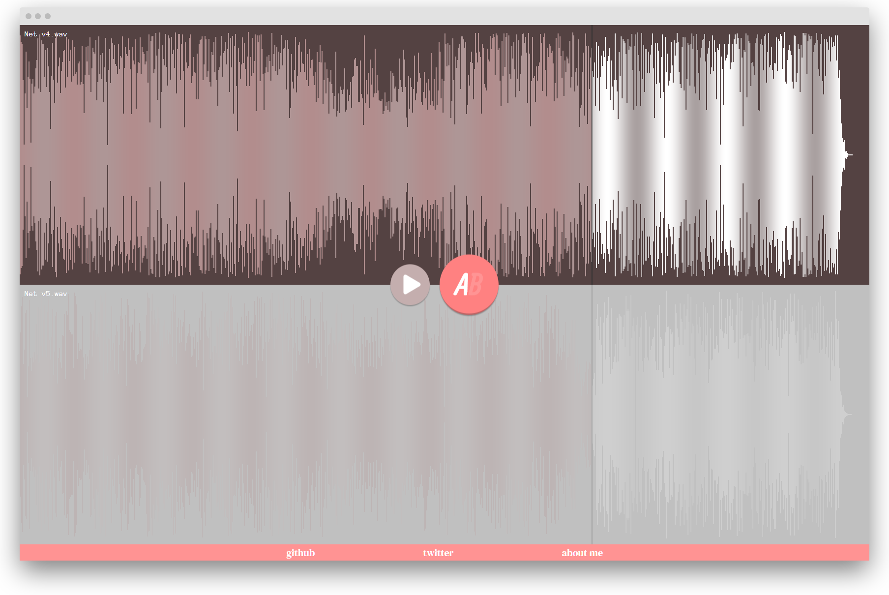

## Overview

<a href="http://audioab.com">audioAB</a> is a small web app that allows you to compare two audio files at the push of a button.

## Stack

React
TypeScript
styled-components

## Motivation

Whenever producing a track and trying to find out which of "v4" or "v24" has the best sounding snare, I always had to put the files into a new Ableton project, map a key to the Solo button, and compare the files.
This process is exhausting and was in need of a more straightforward solution.

## Development

`npm run build-webamp`  
`npm run start`

## License

This project is released under the MIT License.

## App Structure

Components

- ButtonCircle
- PlayButton
- Footer
- Waveform
